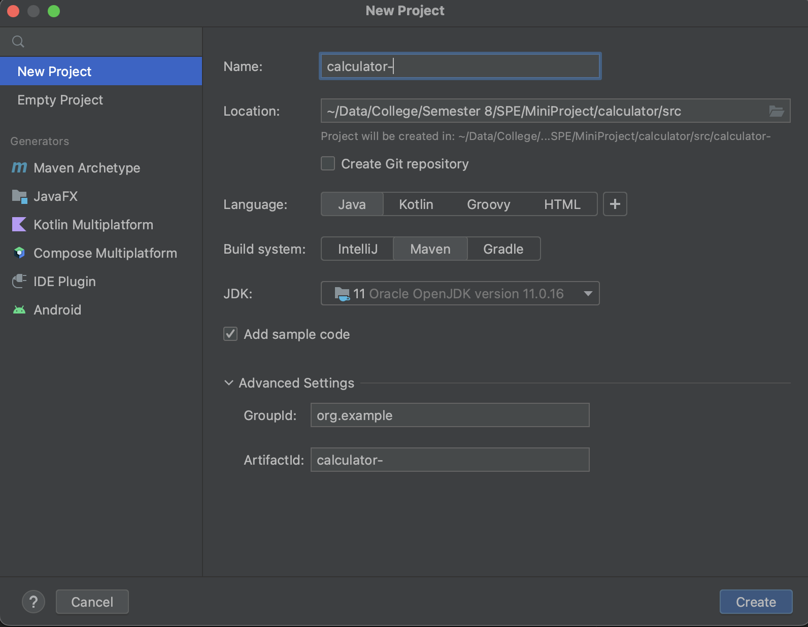
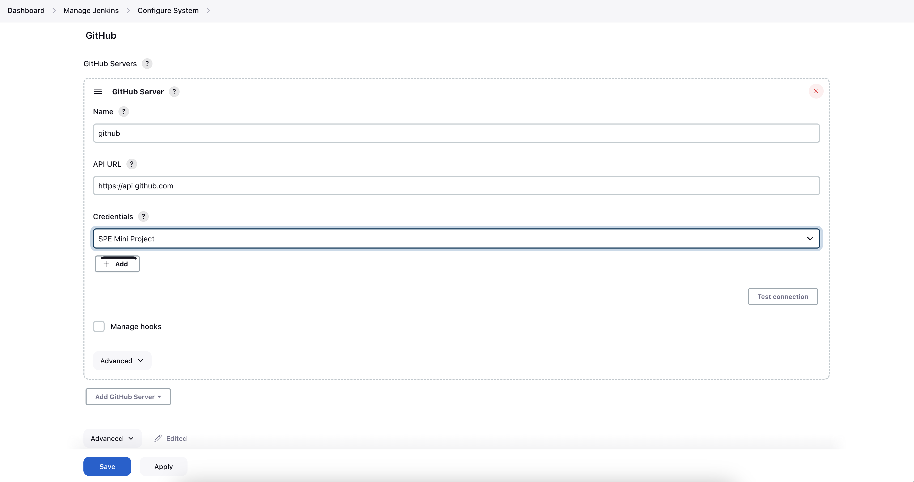
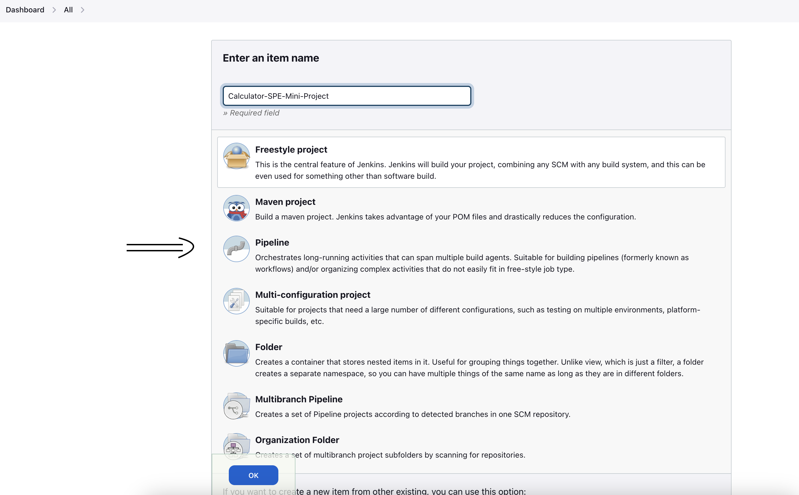
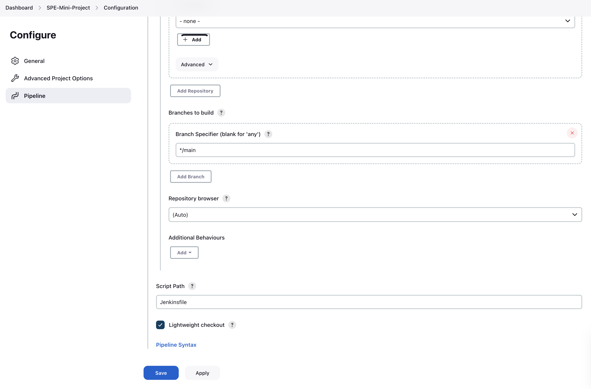
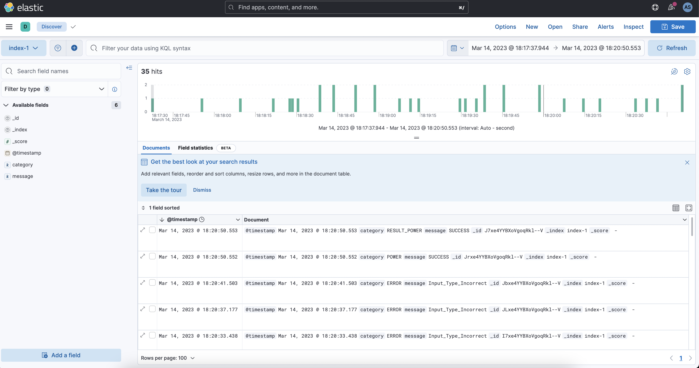

# Calculator

This is a Dev-Ops project. The aim of this project was to create a pipeline for continuous integration, continuous delivery and continuous deployment. The idea to demonstrate is that if there is a change that is made,in the code, when it is pushed to a remote version control system like GitHub, it gets tested, built, delivered and deployed using automation, without any human intervention.

## How to setup the components?

This code in tested in MacOS environment (MacOS 13.2.1). It may not work in other environments. Also, if you are stuck in any part of the process, you may also want to refer to the [Resources folder](https://github.com/architsangal/calculator/tree/main/Resources). They are the resources that I used for solving my errors and getting on board.

### 1. Have a GitHub Repository with Read and Write Access

- Link to the GitHub Repository - [https://github.com/architsangal/calculator](https://github.com/architsangal/calculator)

Either make a fork this repository or make a new repository on GitHub. If you choose to make a new repository, 


Upload the code from this repository, to the newly made repository. 

### 2. Assumptions

I am assuming the following installations are already in place in your local system -

- 'git' version control system

```
$ git --version
git version 2.39.0
```

- Java 11

```
$ java --version
java 11.0.16.1 2022-08-18 LTS
Java(TM) SE Runtime Environment 18.9 (build 11.0.16.1+1-LTS-1)
Java HotSpot(TM) 64-Bit Server VM 18.9 (build 11.0.16.1+1-LTS-1, mixed mode)
```

- 'Jenkins' basic setup, where you can login and create a pipeline job.
```
$ whereis jenkins-lts
jenkins-lts: /opt/homebrew/bin/jenkins-lts
```
- 'Docker' is installed in the local system.
```
$ whereis docker
docker: /usr/local/bin/docker
```
- 'Ansible' is installed in your local system.
```
$ whereis ansible
ansible: /opt/homebrew/bin/ansible /opt/homebrew/share/man/man1/ansible.1
```
- 'ELK Stack' is installed in your local system and it is running.
```
$ docker ps
```

- 'IntelliJ IDEA CE' is installed in the system.


- 'ngrok' is installed on the local system.

The versions of the above softwares may vary upto some extent and depending on how you installed them, using `brew` or `.app` files, etc. 

### 3. New Maven Project

If you have you own code or you want to start from scratch.

- Make a new maven project.


- Select the configurations given below-


- Add your code in the respective files.

- Update the projects with the dependencies which you have included in your pom.xml file using the procedure given below -


Our Current Directory Structure Looks like this-


### 4. Jenkins Setup

- Login into the Jenkins.
- Follow the path: Jenkins Dashboard -> Manage Jenkins ->  Configure System, and replicate the below - 


- SPE Mini Project is a secret text, which is for GitHub WebHook.
- Follow the path: Jenkins Dashboard -> Manage Jenkins ->  Configure Global Tools, and replicate the below - 


- Go to celler repo of jenkins and add path to it's `homebrew.mxcl.jenkins-lts.plist` file.
```
$ cd /opt/homebrew/Cellar/jenkins-lts/
$ cd 2.375.3 #some version
$ ls
```
There you will find a file `homebrew.mxcl.jenkins-lts.plist`. Add path to it
```
<key>EnvironmentVariables</key>
<dict>
    <key>PATH</key>
    <string>/opt/homebrew/bin/:/usr/local/bin/:/usr/local/bin/docker:/usr/local/bin:/usr/bin:/bin:/usr/sbin:/sbin:/Applications/Docker.app/Contents/Resources/bin/:/Users/admin/Library/Group\ Containers/group.com.docker</string>
</dict>
```

After the above step, `homebrew.mxcl.jenkins-lts.plist` shpuld look something like this-
```
<?xml version="1.0" encoding="UTF-8"?>
<!DOCTYPE plist PUBLIC "-//Apple//DTD PLIST 1.0//EN" "http://www.apple.com/DTDs/PropertyList-1.0.dtd">
<plist version="1.0">
<dict>
	<key>Label</key>
	<string>homebrew.mxcl.jenkins-lts</string>
	<key>LimitLoadToSessionType</key>
	<array>
		<string>Aqua</string>
		<string>Background</string>
		<string>LoginWindow</string>
		<string>StandardIO</string>
		<string>System</string>
	</array>
	<key>ProgramArguments</key>
	<array>
		<string>/opt/homebrew/opt/openjdk@17/bin/java</string>
		<string>-Dmail.smtp.starttls.enable=true</string>
		<string>-jar</string>
		<string>/opt/homebrew/opt/jenkins-lts/libexec/jenkins.war</string>
		<string>--httpListenAddress=127.0.0.1</string>
		<string>--httpPort=8080</string>
	</array>
	<key>RunAtLoad</key>
	<true/>
	<key>EnvironmentVariables</key>
	<dict>
		<key>PATH</key>
		<string>/opt/homebrew/bin/:/usr/local/bin/:/usr/local/bin/docker:/usr/local/bin:/usr/bin:/bin:/usr/sbin:/sbin:/Applications/Docker.app/Contents/Resources/bin/:/Users/admin/Library/Group\ Containers/group.com.docker</string>
  	</dict>
</dict>
</plist>
```
- Follow the path: Jenkins Dashboard -> Manage Jenkins ->  Manage Credentials, add the keys and user name, mine looks like the following:


### 5. Jenkins Item Setup

- Add a new Item of type `Pipeline`


- Go to Configure Section, and replicate the following:




### 6. Jenkins Pipeline

- start the 'jenkins' service.
- Click On build Now, you have your pipeline.


### 7. Start ngrok

```
ngrok http 8080
```

- Setup the GitHub WebHook. Now you don't need to do 'Build Now' step again and again, after every change.

### 8. Connect to the server

- Ansible has deployed the file in a container, which represents a server. If it was a remove, server, we could have used `ssh` but as it is on the same system, we directly use the following command-

```
$ docker attach calculator # as the container is a named container.
```

After you are done using the calculator, stop it by pressing 5.

### 9. ELK stack (Monitoring)

Copy the logs from the container to local file system - 
```
docker cp calculator:/calculator.log /Users/<user>/<path>
```

- Run the `grok` pattern on `kibana`.



